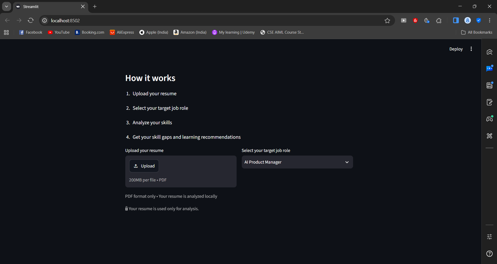

# Smart Resume Skill Gap Analyzer

A simple AI-powered tool that analyzes a resume against a target job role, identifies skill gaps, and provides learning recommendations.
## Project Overview

The Smart Resume Skill Gap Analyzer helps students and job seekers understand how well their resume matches a selected job role. It identifies relevant skills, highlights missing skills, calculates a match score, and provides learning recommendations.

## Features

- Upload a resume in PDF format
- Select a target job role
- Extract resume text
- Identify relevant skills
- Find missing skills
- Calculate resume match score
- Get learning recommendations
- Get resume improvement suggestions
## Technologies Used

- Python
- Streamlit
- pypdf
- JSON
## Project Structure

```text
Smart-Resume-Skill-Gap-Analyzer/
├── app.py
├── skills.json
├── requirements.txt
├── README.md
└── screenshots/
```
## How It Works

1. Upload your resume as a PDF.
2. Select your target job role.
3. The system extracts the resume text.
4. Relevant skills are detected.
5. Missing skills are identified.
6. A resume match score is calculated.
7. Learning recommendations are provided.
## Disclaimer

This tool provides skill-gap insights based on the selected job role. The results are intended for guidance and may not represent actual hiring requirements.
## Future Improvements

- Use advanced AI/NLP for better skill detection
- Add more job roles
- Provide personalized course recommendations
- Improve resume analysis accuracy
- Deploy the application online
## Screenshots

Screenshots of the application will be added here.
## Screenshots

